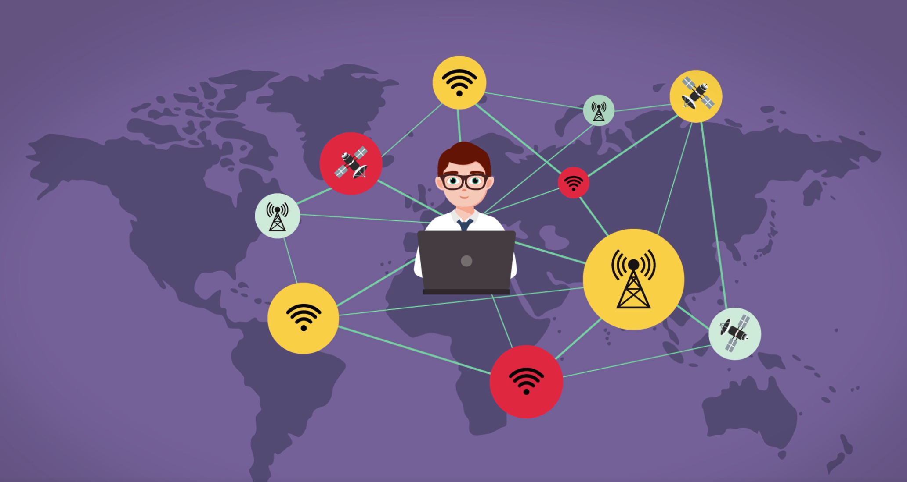

The Internet makes many things possible for us, from communication to learning to entertainment. We'll learn more about what the Internet is and how to connect to it in this lesson.

**By the end of this lesson, you will be able to:**

*   Describe common uses of the Internet
*   Describe the Internet
*   Describe methods for connecting to the Internet
*   Connect a Windows 10 device to the Internet using Wi-Fi

Keep the following **guiding questions** in mind as you complete this lesson. See if you can answer them on your own at the end of the lesson:

1.  What can we do using the Internet?
2.  What is the Internet?
3.  How can you connect to the Internet?