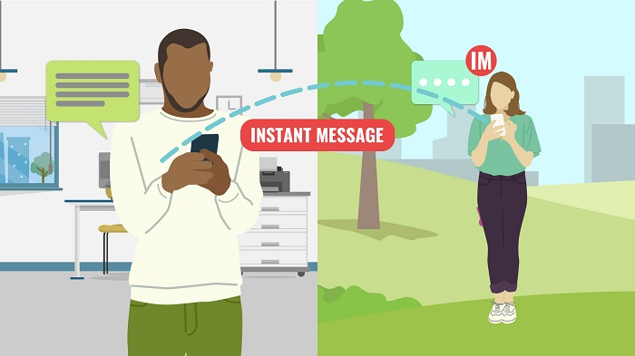

The Internet and the Web make it possible for us to stay in touch with others near and far. There are apps and services that make it easy to communicate with others online through **instant messaging (IM)**, **voice calling**, and **video calling**.

In this lesson, we'll explore these methods of communicating online.

**By the end of this lesson, you will be able to:**

*   Describe common ways to communicate with others online
*   Use Skype or similar services to send instant messages to others
*   Make voice calls on the Web
*   Make video calls on the Web

Keep the following **guiding questions** in mind as you complete this lesson. See if you can answer them on your own at the end of the lesson:

1.  How can you stay in touch with friends, family and others using the Internet and the Web?
2.  What is instant messaging and what type of communication is it useful for?
3.  How can you use Skype or Skype for Business to quickly communicate with with others online?