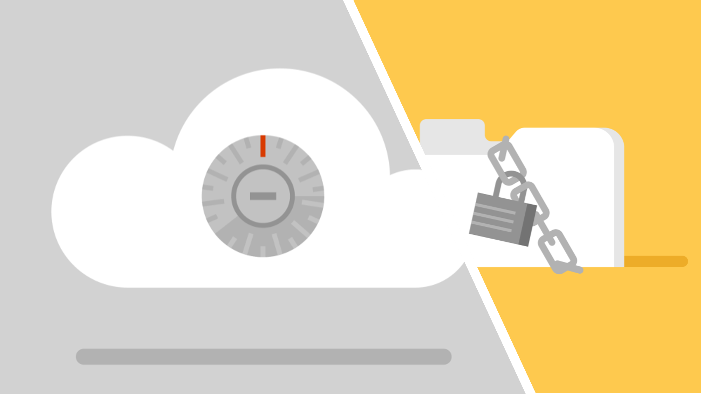

We can get a lot done using the Internet and the Web. However, there are some safety and privacy risks to keep in mind as you use the Internet.

In this lesson, you will learn about some of the safety risks that can affect you when you are using the Internet, and tips for saying safe and keeping your information private online.

**By the end of this lesson, you will be able to:**

*   Describe safety risks associated with using the Internet and the Web.
*   Identify signs of online scams like phishing
*   Describe best practices for safely interacting with other people online.
*   Identify characteristics of a strong password.
*   Describe best practices for sharing information online
*   Describe the importance of managing your digital footprint

Keep the following **guiding questions** in mind as you complete this lesson. See if you can answer them on your own at the end of the lesson:

1.  What are some dangers of using the Internet and the Web?
2.  What are some signs of safety risks and scams online?
3.  What steps can you take to stay safe while using the Internet?
4.  How can you manage your digital footprint?