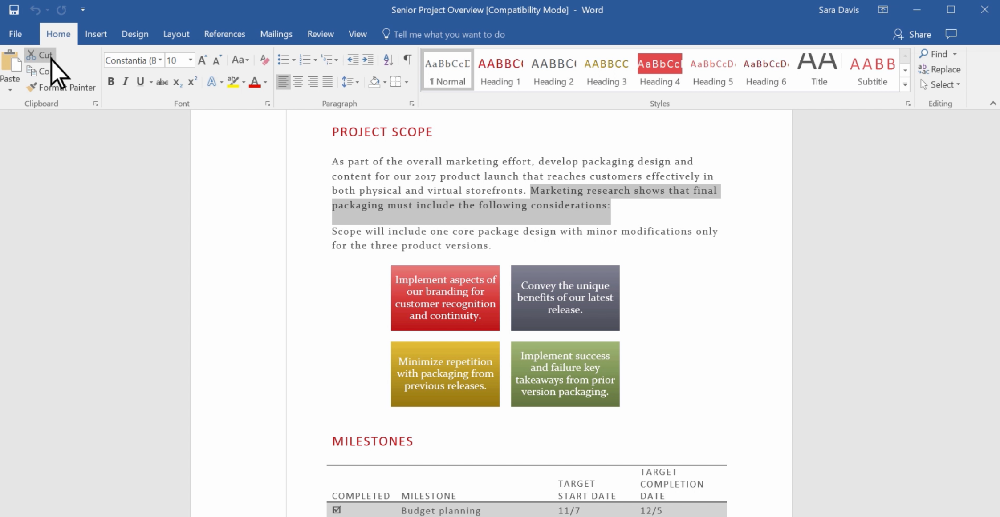

Microsoft Word is an Office app that allows you to create and work with text documents. With Microsoft Word, you can accomplish your daily tasks and express your ideas in a professional way.

In this lesson, you will learn how to start using Microsoft Word to create documents, write and edit text, save and print.

**By the end of this lesson you will be able to:**

*   Create a Word document using a Word template.
*   Save a document to your computer or OneDrive.
*   Print a document.

Keep the following **guiding questions** in mind as you complete this lesson. You should be able to answer them on your own at the end of the lesson:

1.  What can you use Microsoft Word for?
2.  How do you create a new document?
3.  How do you save your work in Word?
4.  How do you print a document in Word?