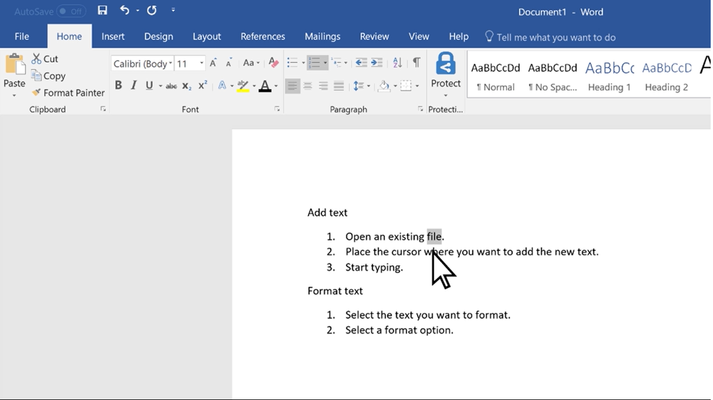

Microsoft Word is fundamentally a word processing program, which means it's designed to allow you to create, edit and format text-based documents.

In this lesson, you will learn how to work with text in Word documents.

**By the end of this lesson, you will be able to:**

*   Add text and modify the font styles of text in a Word document
*   Check text spelling and grammar
*   Find and replace text in a Word document
*   Add and format lists

Keep the following **guiding questions** in mind as you complete this lesson. You should be able to answer them on your own at the end of the lesson:

1.  What properties of text can you modify in a Word document?
2.  How can you verify that your text is spelled properly and follows standard grammar guidelines?
3.  How can you find the location of a word or phrase in your document?
4.  How can you quickly replace a word or phrase in multiple parts of your document?