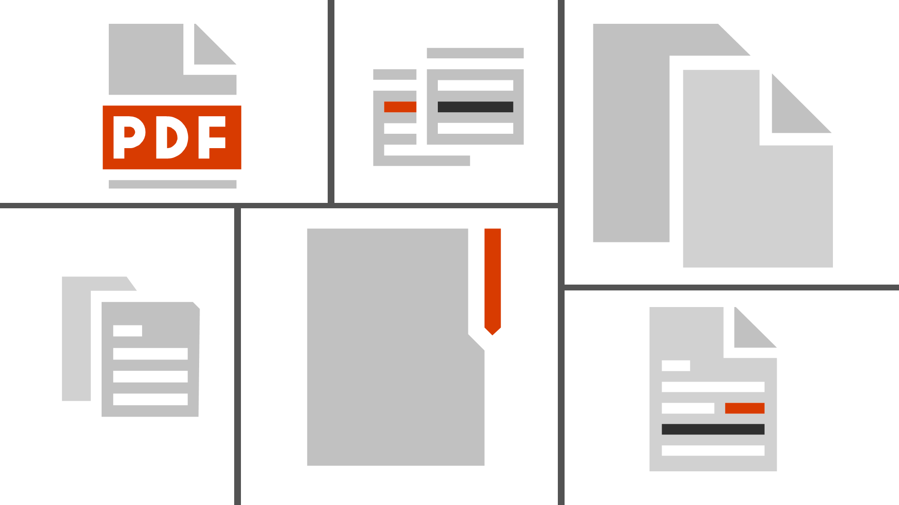

By default when you create a document in Word, it will be saved as a Word document, with the extension *.doc* or *.docx*. Text documents can also be saved as view-only files using the PDF file type.

In this lesson, you'll learn how to work with PDF files in Microsoft Word.

**By the end of this lesson you will be able to:**

*   Covert a Word document to the PDF format.
*   Edit a PDF file.

Keep the following **guiding questions** in mind as you complete this lesson. You should be able to answer them on your own at the end of the lesson:

1.  When might you want to save a document as a PDF file?
2.  How can you convert a document to PDF?
3.  How can you edit PDF files in Microsoft Word?