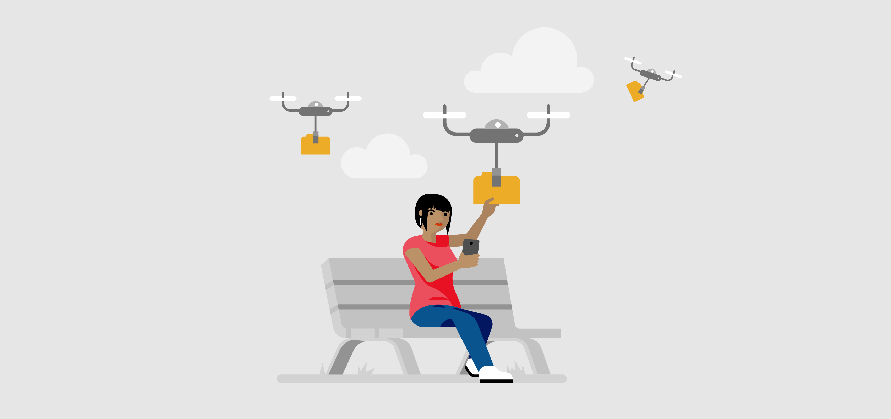

Thanks to the Internet, we can store information from one device and access it using another, almost instantly. **The cloud** is a collection of software services that run across the world using the Internet, instead of running on a single user's computer.

Storing content on the cloud makes it easier to access our information from anywhere, instead of storing it locally, or only on our computer.

In this lesson, you will learn about the Cloud and how you can use it.

**By the end of this lesson you will be able to:**

*   Describe uses of cloud services like OneDrive
*   Sign in to OneDrive.
*   Use OneDrive from a mobile device
*   Create, upload, restore and share files using OneDrive

Keep the following **guiding questions** in mind as you complete this lesson. See if you can answer them on your own at the end of the lesson:

1.  What is the cloud?
2.  How does the cloud make it easier to store and share files?
3.  How can you use OneDrive to access your files from anywhere?
